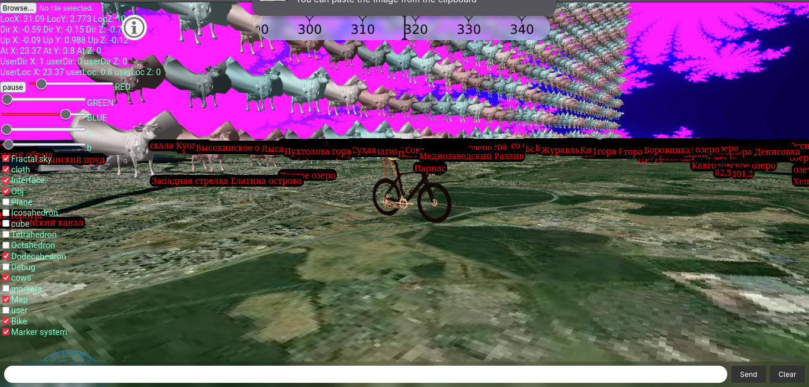
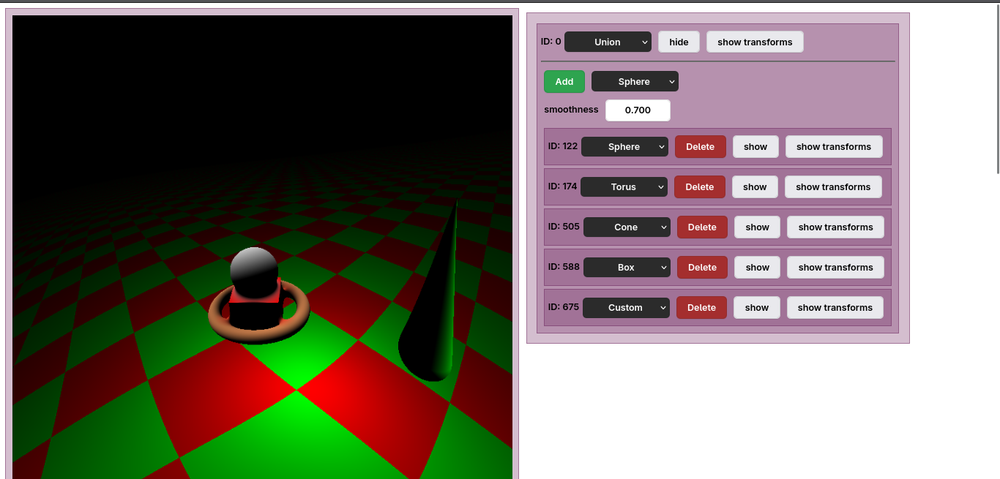
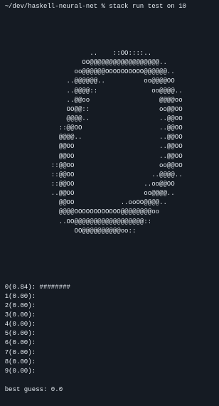
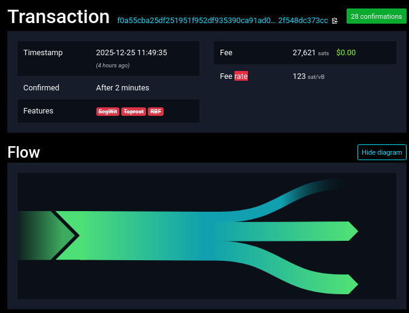
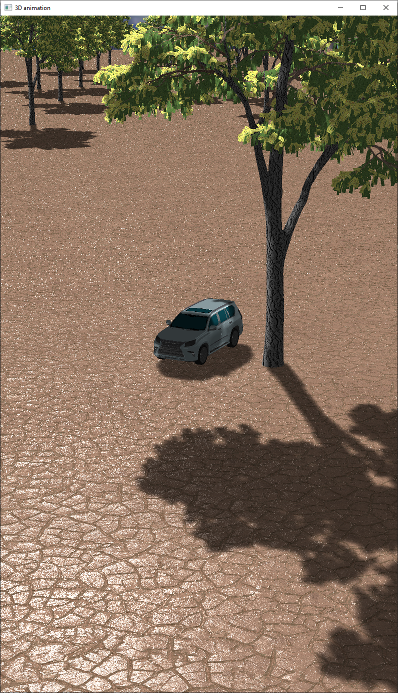
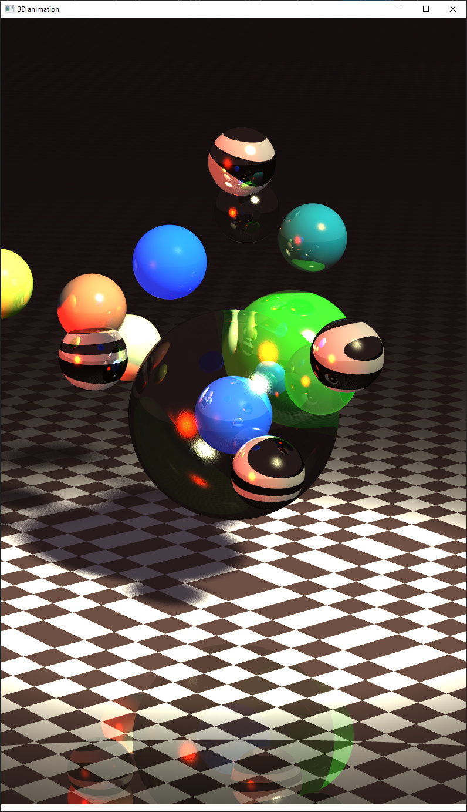

<small>[English version](me)</small>

Привет. Меня зовут Лука.

Я увлекаюсь программированием, чтением [блогов](http://rss.shoggothstaring.com), медитацией и горными лыжами.

Имею опыт программирования на следующих языках:

- C/C++ (Vulkan, OpenGL, WinAPI, SDL2)
- Haskell (Hakyll, Servant)
- Python (pytorch, numpy, pandas, matplotlib, seaborn)
- JavaScript (React, Node.js, Express.js, three.js, Rollup(Webpack))

Использую Linux(Arch), могу его администрировать на базовом уровне. В коде стараюсь держаться принципов [grug](https://grugbrain.dev/) ~~и немножко гольфить код~~.

Среди моих достижений можно отметить:

- 1 место на Колмогоровских Чтениях (2023) - я был членом команды по написанию движка 3D-графики на Vulkan
- Призер регионального этапа ВСОШ по программированию (2024).

В данный момент я имею уровень B2 по немецкому, C1 по английскому, пара сотен [Anki](srs)-карточек по японскому.

Мое мировоззрение во многом совпадает с [LessWrong](https://lesswrong.com/) и Bay Area в целом.

### Проекты

В случайном порядке:

#### [shoggothstaring.com](about)

Этот сайт написан на Haskell [здесь](https://github.com/30be/30be.github.io/blob/main/main.hs).

#### [Bike on a map (Online)](projects/SUM2023/PROJECT/dist/)

[{width=30%}](bike.png)
Грузится долго: рассчитан на открытие с ПК.
Внутри - самодельный 3D-движок, в котором можно покататься на велосипеде с развевающимся флагом. Помимо прочего, можно включить пару десятков тысяч коров с крылышками, фрактал Мандельброта на небе.

#### [Web raymarching system (Online)](projects/SUM2024/WebRaymarching/)

[{width=30%}](raymarching.png)
Система рисования 3D-графики с использованием алгоритма raymarching на GPU с помощью динамически создаваемых шейдеров.

#### [Haskell neural network](https://github.com/30be/haskell-neural-net)

[{width=30%}](haskell-nn.png)
Классификатор MNIST с нуля: backpropagation, [online learning](https://en.wikipedia.org/wiki/Online_machine_learning), консольный интерфейс.

#### [Bitcoin in Haskell](https://github.com/30be/bitchs)

[{width=30%}](bitcoin-transaction.png)

Простой bitcoin-кошелек, написанный с нуля. Вдохновлен [Andrej Karpathy](https://karpathy.github.io/2021/06/21/blockchain/). Эллиптические кривые, SHA-256, сериализация по стандарту, базовая работоспособность.

#### OpenGL renderer

[{width=30%}](T06ANIM.png)
Написанный с нуля на C++ 3D-движок в реальном времени с отложенным освещением, прозрачностью, мультитекстурами, анимацией DAE/Collada.

#### CPU Raytracer

[{width=30%}](T05RT.png)
Параллельный рендерер с поддержкой прозрачности, материалов, сложных объектов, загрузки моделей с текстурами

#### [textbook-rss](https://github.com/30be/TextbookRSS)

Небольшой проект на Python, позволяющий генерировать RSS-feed для любых книг.

### Связь

E-mail: <ls4@shoggothstaring.com>

Telegram: [@cgsg162](https://t.me/cgsg162)

PGP:

```PGP
-----BEGIN PGP PUBLIC KEY BLOCK-----

mDMEaOI7MBYJKwYBBAHaRw8BAQdA+2wnekY3uI0lmJX1EGE4kzPDZmLOiCtp9KWm
Y1Pt+Di0KkxTNCAoMjAyNS0xMC0wNSkgPGxzNEBzaG9nZ290aHN0YXJpbmcuY29t
PoiQBBMWCgA4FiEEANwYDsL5P9/1nJQ3BC8uYR9UBJ8FAmjiOzACGwMFCwkIBwIG
FQoJCAsCBBYCAwECHgECF4AACgkQBC8uYR9UBJ8GsQEA7tKxdjLNkXUPvQwZy3QY
Di9BbfPzMNhf3hJGysqSo0QBAPzLO8fz8YPNqRyVqb02yuedOuRgvqM6rZOtnuO5
A5AAuDgEaOI7MBIKKwYBBAGXVQEFAQEHQIUPfYFCR1kj7sC2CTDukeJgtC/Dv9fs
qvAPLKuyowEUAwEIB4h4BBgWCgAgFiEEANwYDsL5P9/1nJQ3BC8uYR9UBJ8FAmji
OzACGwwACgkQBC8uYR9UBJ9EzAEAqUTMKrUaeTUVQNQmOKxDvVMRa1eAQJZUlIY9
hhZ39HwBALvRI1091NdEWw0zJkXiq3straGKtL8DESid+fNfD2UP
=fVi6
-----END PGP PUBLIC KEY BLOCK-----
```
